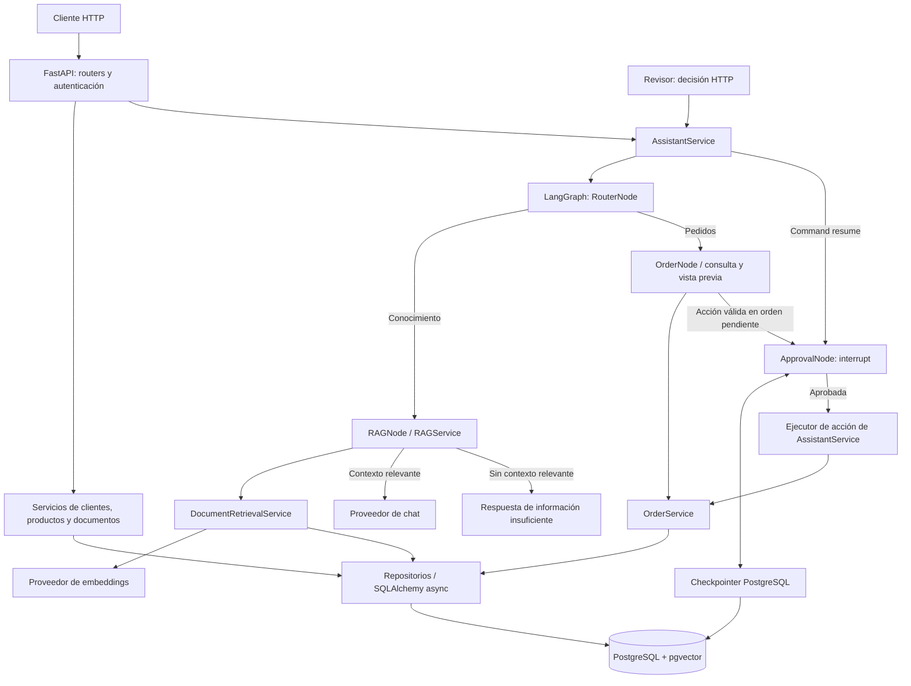

# Intelligent Order Assistant

Backend asíncrono para gestionar pedidos y consultar documentación de un comercio,
con **FastAPI, PostgreSQL/pgvector y LangGraph**. Integra operaciones transaccionales
de inventario con un asistente que recupera información y prepara acciones de
pedidos para revisión humana antes de ejecutarlas.

El proyecto aborda dos necesidades: mantener pedidos, precios e inventario
consistentes ante errores o solicitudes concurrentes, y ofrecer asistencia sobre
políticas comerciales sin convertir una pregunta en autorización para modificar
un pedido. Como proyecto de portafolio Backend Python, muestra separación de
capas, contratos HTTP, persistencia asíncrona, pruebas de concurrencia y un flujo
HITL (*human in the loop*) persistente y recuperable.

**Estado:** las cinco fases del [plan de implementación](docs/implementation-plan.md)
están completadas y verificadas localmente. GitHub Actions pasó también en remoto.
Las llamadas reales a OpenAI y el despliegue público siguen pendientes.

## Características implementadas

- CRUD de clientes y productos, validación Pydantic y restricciones de eliminación
  cuando existen pedidos asociados.
- Creación de pedidos con reserva de stock, rechazo de productos inactivos o sin
  existencias, y precios, subtotales y totales calculados en el servidor con `Decimal`.
- Transiciones `pending → confirmed` y `pending → cancelled`. La cancelación
  restituye inventario; una orden confirmada ya no puede cancelarse con este flujo.
- Transacciones con rollback, bloqueo de filas de órdenes/productos y adquisición
  de bloqueos de productos en orden consistente.
- Ingestión de texto con fragmentos de 1000 caracteres y solapamiento de 200;
  almacenamiento de embeddings de 1536 dimensiones y búsqueda por distancia coseno.
- RAG con umbral controlado por el servidor. Sin fragmentos suficientemente
  relevantes, devuelve un fallback y no invoca al proveedor de chat.
- Routing determinístico de preguntas documentales, consultas y solicitudes de
  confirmación/cancelación mediante LangGraph.
- Aprobación o rechazo separado de la solicitud, vista previa persistida,
  caducidad y validación de cambios en la orden antes de ejecutar.
- Checkpoints PostgreSQL y recibo de ejecución confirmado junto con la acción:
  repetir una decisión completada devuelve el resultado sin repetir el inventario.
- Credenciales Bearer distintas para operador y revisor, endpoints de salud,
  demo offline, migraciones Alembic, pruebas y workflow de CI.

## Arquitectura y flujo del asistente



Los routers validan entradas y traducen errores; los servicios concentran las
reglas de negocio y las transacciones. Los nodos reutilizan esos servicios.
Embeddings y chat se consumen mediante interfaces intercambiables, con proveedores
OpenAI o demo. PostgreSQL almacena negocio, solicitudes, recibos y checkpoints;
no se necesitan Redis ni RabbitMQ para el alcance actual.

### RAG

1. `POST /api/v1/documents` fragmenta el texto, genera embeddings y los persiste.
2. `POST /api/v1/assistant/ask` envía la pregunta al router del grafo.
3. Para conocimiento, se genera un embedding de consulta y se recuperan hasta
   `limit` fragmentos; se conservan los de distancia `<= RAG_MAX_DISTANCE`.
4. Con contexto relevante, se concatenan los fragmentos y se invoca al chat con
   instrucciones para responder en español usando ese contexto.
5. Sin contexto relevante, se responde:

   > No tengo información suficiente en la documentación disponible para responder esa pregunta.

El endpoint acepta `limit` de 1 a 20 (predeterminado 5). El cliente no controla
`max_distance`; el servidor lo propaga desde configuración al grafo y servicios.
`/documents/search` ofrece búsqueda por similitud **sin aplicar ese umbral** y
responde con los fragmentos, sin invocar al chat.

### Pedidos y aprobación humana

Una consulta como `Consulta la orden 15` solo lee. `Cancelar la orden 15` o
`Confirmar el pedido 15` crea una solicitud si la orden sigue pendiente. Los casos
sin ID, las acciones contradictorias y las negaciones detectadas piden aclaración.

El grafo se pausa con `interrupt()`. La respuesta contiene un `run_id` y una vista
previa con acción, orden, estado, total y `updated_at`. Un revisor inspecciona esa
vista y envía `{"approve": true}` o `{"approve": false}` en otro endpoint.
`AssistantService` reanuda el grafo con `Command(resume=...)`.

La solicitud caduca. Si el estado o `updated_at` de la orden cambiaron, la ejecución
se invalida y requiere otra solicitud. Las reanudaciones se serializan mediante
un advisory lock PostgreSQL. El recibo y la acción se confirman en una transacción,
protegiendo el inventario ante reintentos después de perder la respuesta.

## Tecnologías y estructura

| Área | Tecnologías |
| --- | --- |
| API y validación | Python, FastAPI, Pydantic, Uvicorn |
| Persistencia | SQLAlchemy 2 async, asyncpg, PostgreSQL 17, pgvector, Alembic |
| Orquestación e IA | LangGraph, checkpointer PostgreSQL con psycopg, SDK OpenAI |
| Calidad | pytest, pytest-asyncio, HTTPX, fakes/mocks, Ruff |
| Entorno y entrega | Poetry, `poetry.lock`, Docker, Compose, GitHub Actions |

| Ruta | Responsabilidad |
| --- | --- |
| `app/api/` | Endpoints, dependencias y errores HTTP |
| `app/services/` | Negocio, transacciones, ingestión, recuperación y asistente |
| `app/repositories/` | Acceso a datos y consultas SQLAlchemy |
| `app/models/`, `app/schemas/` | Entidades persistidas y contratos Pydantic |
| `app/graph/` | Estado, nodos, routing y checkpointer |
| `app/ai/` | Interfaces, factories y proveedores de embeddings/chat |
| `app/core/` | Configuración, sesiones y credenciales |
| `alembic/`, `scripts/` | Migraciones, inicialización y demo |
| `tests/` | Unitarias, integración y evaluación de retrieval |

## Requisitos

- Python **3.12** recomendado; `pyproject.toml` declara compatibilidad `^3.12`.
- Poetry **2.4.1**, versión utilizada en Docker y CI.
- Docker y Compose para PostgreSQL y ejecución en contenedores.
- Para `compose.testing.yaml`, Compose con soporte de `!reset` y `!override`;
  el stack se verificó con Compose **5.1.4**.
- `curl` para los ejemplos HTTP y OpenSSL para generar credenciales.
- Clave OpenAI únicamente si eliges el proveedor `openai`; la demo es offline.

Los comandos siguientes se ejecutan desde la raíz del repositorio. Si ya tienes
servicios usando los puertos indicados, elige un entorno aislado antes de iniciar
contenedores. Los ejemplos escriben datos y esquema solo en las bases locales
que configures; verifica el destino antes de ejecutarlos.

## Instalación y configuración

```bash
poetry install --no-root
if [ ! -e .env ]; then cp .env.example .env; fi
```

No sobrescribas un `.env` existente. Edita ese archivo con tu configuración y
conserva las credenciales fuera de Git. La aplicación carga variables del entorno
y `.env`; las variables exportadas tienen prioridad. Genera por separado las
claves de operador y revisor con `openssl rand -hex 32` y guarda cada valor en su
variable correspondiente. No uses la misma clave para ambos roles.

| Variable | Uso y valor de referencia |
| --- | --- |
| `APP_NAME` | Título del API; `Intelligent Order Assistant` |
| `ENVIRONMENT` | Etiqueta del entorno; `development` por defecto; no valida el destino de la base |
| `DATABASE_URL` | URL SQLAlchemy `postgresql+asyncpg://…`; obligatoria, local en `.env.example` |
| `OPERATOR_API_KEY` | Credencial Bearer del operador, al menos 32 caracteres |
| `REVIEWER_API_KEY` | Credencial Bearer distinta del revisor, al menos 32 caracteres |
| `AI_PROVIDER` | `demo` u `openai`; `.env.example` usa `demo`, Settings por defecto usa `openai` |
| `OPENAI_API_KEY` | Secreto necesario para solicitudes reales de embeddings/chat |
| `OPENAI_EMBEDDING_MODEL` | Modelo configurable; ejemplo `text-embedding-3-small`; dimensiones solicitadas: 1536 |
| `OPENAI_CHAT_MODEL` | Modelo configurable; valor del repositorio: `gpt-5.6-luna` |
| `RAG_MAX_DISTANCE` | Distancia máxima aceptada por RAG; `0.4`, rango 0–2 |
| `APPROVAL_TTL_SECONDS` | Vigencia positiva de solicitudes; `900` segundos por defecto |
| `DB_PASSWORD` | Contraseña PostgreSQL del Compose de despliegue; usa un valor hexadecimal generado |
| `TEST_DATABASE_URL` | Solo herramientas de testing; localhost/127.0.0.1:5434, base `intelligent_order_assistant_test` |

Cambiar el modelo de embeddings requiere conservar compatibilidad con 1536
dimensiones y revisar el corpus. Al cambiar entre demo y OpenAI, usa una base
separada o reingesta los documentos; no mezcles sus embeddings. Los modelos
configurados son valores del código, no una garantía de disponibilidad en tu cuenta.

## Ejecución local

Para un entorno de desarrollo nuevo, `.env.example` apunta a
`localhost:5435/intelligent_orders` con las credenciales locales del Compose.
Mantén `AI_PROVIDER=demo` para comenzar sin solicitudes externas.

```bash
docker compose up -d db
docker compose exec -T db pg_isready -U postgres -d intelligent_orders
```

Espera a que PostgreSQL acepte conexiones. Comprueba la configuración efectiva
sin mostrar su contraseña y verifica la base del contenedor:

```bash
poetry run python -c 'from app.core.config import settings; from sqlalchemy.engine import make_url; u = make_url(settings.database_url); print(u.host, u.port, u.database)'
docker compose exec -T db psql -U postgres -d intelligent_orders -Atc 'SELECT current_database();'
```

Continúa solo si la URL efectiva corresponde a esa base local y autorizas la
inicialización de su esquema:

```bash
poetry run python -m scripts.initialize_database
poetry run uvicorn app.main:app --reload
```

La inicialización ejecuta Alembic hasta `head` y `AsyncPostgresSaver.setup()`.
Las migraciones de negocio y las tablas del checkpointer tienen administradores
separados; Alembic excluye esas tablas de su comparación de metadata. Iniciar el
API o atender una petición no ejecuta migraciones automáticamente.

| URL | Uso |
| --- | --- |
| `http://127.0.0.1:8000/docs` | Swagger UI; botón Authorize para la credencial Bearer |
| `http://127.0.0.1:8000/redoc` | Documentación de contratos |
| `http://127.0.0.1:8000/openapi.json` | Esquema OpenAPI |
| `http://127.0.0.1:8000/health` | Respuesta del proceso, sin verificar la base |
| `http://127.0.0.1:8000/ready` | Conexión, tablas de solicitudes/checkpoints y credenciales configuradas |

`/health` y `/ready` no requieren Bearer. Readiness no comprueba disponibilidad del
proveedor de IA ni todos los objetos del esquema. Desarrollo expone PostgreSQL en
`127.0.0.1:5435`; testing usa `127.0.0.1:5434`.

## Autenticación y endpoints

Todas las rutas `/api/v1` requieren `Authorization: Bearer <clave>`.
Operador y revisor pueden usar las rutas generales; las decisiones del asistente
y la confirmación/cancelación directa requieren **revisor**. El sistema registra
roles compartidos, no usuarios individuales: una solicitud originada por el rol
revisor no puede ser decidida por ese mismo rol.

| Método | Ruta | Función |
| --- | --- | --- |
| POST / GET | `/api/v1/customers` | Crear / listar clientes |
| GET / PATCH / DELETE | `/api/v1/customers/{customer_id}` | Consultar / editar / eliminar |
| POST / GET | `/api/v1/products` | Crear / listar productos |
| GET / PATCH / DELETE | `/api/v1/products/{product_id}` | Consultar / editar / eliminar |
| POST / GET | `/api/v1/orders` | Crear / listar pedidos |
| GET | `/api/v1/orders/{order_id}` | Consultar pedido con sus partidas |
| POST | `/api/v1/orders/{order_id}/confirm` | Confirmar; exclusivo de revisor |
| POST | `/api/v1/orders/{order_id}/cancel` | Cancelar; exclusivo de revisor |
| POST | `/api/v1/documents` | Ingestar título, contenido y fuente opcional |
| POST | `/api/v1/documents/search` | Buscar fragmentos con `query` y `limit` |
| POST | `/api/v1/assistant/ask` | Preguntar con `question` y `limit` |
| GET | `/api/v1/assistant/runs/{run_id}` | Revisar solicitud o resultado persistido |
| POST | `/api/v1/assistant/runs/{run_id}/decision` | Aprobar/rechazar; exclusivo de revisor |

Los POST directos de confirmación/cancelación son comandos explícitos del revisor,
sin crear una solicitud HITL. El asistente siempre utiliza pausa y decisión.
Los errores incluyen 401 por credenciales inválidas, 403 por rol/aprobación propia,
404 por recurso inexistente, 409 por conflictos, 410 por aprobación caducada y
422 por entradas inválidas. Sin credenciales de servicio configuradas se devuelve
503. Las transiciones directas repetidas devuelven 409; el replay de decisiones
HITL completadas devuelve el resultado previo.

### Ejemplos HTTP

Los ejemplos asumen un API local configurado en modo demo. Exporta en tu shell
`OPERATOR_API_KEY` y `REVIEWER_API_KEY` con las claves de ese mismo API; no se
cargan en la shell automáticamente al editar `.env`. No publiques sus valores.

```bash
export BASE_URL=http://127.0.0.1:8000
curl --fail-with-body "$BASE_URL/health"

curl --fail-with-body -X POST "$BASE_URL/api/v1/documents" \
  -H "Authorization: Bearer $OPERATOR_API_KEY" \
  -H 'Content-Type: application/json' \
  -d '{"title":"Devoluciones","content":"Las devoluciones se aceptan dentro de 30 días con el empaque original.","source":"ejemplo-local"}'

curl --fail-with-body -X POST "$BASE_URL/api/v1/assistant/ask" \
  -H "Authorization: Bearer $OPERATOR_API_KEY" \
  -H 'Content-Type: application/json' \
  -d '{"question":"¿Qué política de devoluciones tienen?","limit":5}'
```

Para crear un pedido sintético, crea primero cliente y producto:

```bash
curl --fail-with-body -X POST "$BASE_URL/api/v1/customers" \
  -H "Authorization: Bearer $OPERATOR_API_KEY" \
  -H 'Content-Type: application/json' \
  -d '{"name":"Cliente Demo","email":"demo@example.com"}'

curl --fail-with-body -X POST "$BASE_URL/api/v1/products" \
  -H "Authorization: Bearer $OPERATOR_API_KEY" \
  -H 'Content-Type: application/json' \
  -d '{"sku":"DEMO-001","name":"Producto Demo","price":"25.50","stock":10}'
```

Asigna los IDs devueltos (no asumas que siempre son 1) y crea el pedido. Usa un
email y SKU nuevos si ya existen los ejemplos:

```bash
CUSTOMER_ID=1 # Sustituir por el ID real devuelto.
PRODUCT_ID=1  # Sustituir por el ID real devuelto.
curl --fail-with-body -X POST "$BASE_URL/api/v1/orders" \
  -H "Authorization: Bearer $OPERATOR_API_KEY" \
  -H 'Content-Type: application/json' \
  -d "{\"customer_id\":$CUSTOMER_ID,\"items\":[{\"product_id\":$PRODUCT_ID,\"quantity\":2}]}"
```

El backend obtiene el precio del producto: dos unidades a 25.50 generan total
51.00 y stock restante 8. Asigna `ORDER_ID` desde esa respuesta y solicita la
cancelación, todavía sin ejecutarla:

```bash
ORDER_ID=1 # Sustituir por el ID del pedido creado.
curl --fail-with-body -X POST "$BASE_URL/api/v1/assistant/ask" \
  -H "Authorization: Bearer $OPERATOR_API_KEY" \
  -H 'Content-Type: application/json' \
  -d "{\"question\":\"Cancelar la orden $ORDER_ID\",\"limit\":5}"
```

Si la orden sigue pendiente, la respuesta incluye `status: pending_approval`,
`run_id` y `approval`. Copia el UUID real a `RUN_ID` y revisa:

```bash
RUN_ID=UUID_DEVUELTO
curl --fail-with-body "$BASE_URL/api/v1/assistant/runs/$RUN_ID" \
  -H "Authorization: Bearer $REVIEWER_API_KEY"
```

**Solo después de aprobar expresamente esa orden y acción**, envía la decisión:

```bash
curl --fail-with-body -X POST "$BASE_URL/api/v1/assistant/runs/$RUN_ID/decision" \
  -H "Authorization: Bearer $REVIEWER_API_KEY" \
  -H 'Content-Type: application/json' \
  -d '{"approve":true}'
```

Para rechazar, usa `{"approve":false}` en lugar de aprobar. El booleano debe ser
real, no una cadena. La decisión usa el ID y la acción persistidos; no permite
sustituirlos. Tras cancelar, comprueba la orden y el producto con sus rutas GET:
stock 10. Repetir la misma aprobación completada conserva ese stock; intentar
cambiar la decisión devuelve 409. Una solicitud expirada exige preparar otra.

## Ejecución Docker

La imagen usa Python fijado por digest, Poetry fijado y dependencias de producción
del lockfile. Corre como UID 10001 y no copia `.env`. El Compose de despliegue fija
PostgreSQL/pgvector por digest, mantiene datos en un volumen y publica el API
solo en `127.0.0.1:8000`. El API usa filesystem de solo lectura, sin capabilities
y con `no-new-privileges`.

Con `.env` configurado, incluidos `DB_PASSWORD` y ambas claves, revisa y autoriza
la inicialización antes de arrancar este stack persistente:

```bash
docker build -t intelligent-order-assistant:local .
docker compose -p ioa-demo -f compose.deploy.yaml config --quiet
docker compose -p ioa-demo -f compose.deploy.yaml up -d --no-build
```

El orden es PostgreSQL saludable → servicio `migrate` → API. Compose establece
su propia conexión a `db:5432/intelligent_orders`; no utiliza el `DATABASE_URL`
local de `.env`. El API requiere que la inicialización termine correctamente.
El build local se verificó con el builder clásico; para builds mediante Compose
se recomienda disponer de Buildx. No ejecutes varios inicializadores a la vez.

Para actualizar una instancia, reconstruye la imagen y recrea explícitamente
`migrate` y `api` antes de utilizar la nueva versión:

```bash
docker build -t intelligent-order-assistant:local .
docker compose -p ioa-demo -f compose.deploy.yaml up -d --no-build --force-recreate migrate api
```

Detener y retirar contenedores sin borrar el volumen:

```bash
docker compose -p ioa-demo -f compose.deploy.yaml down
```

El nombre separado evita sustituir los servicios de `compose.yaml`. Este stack
persistente no se ha validado con datos de producción. La evidencia disponible
corresponde a imágenes y stacks efímeros de testing. No hay despliegue cloud
implementado; una exposición pública requiere TLS, gestión de secretos y backups.

## Demostración offline en un stack aislado

`AI_PROVIDER=demo` genera vectores determinísticos de 1536 posiciones según temas
predefinidos (devoluciones, envíos y pagos); su proveedor de chat devuelve el
contexto recuperado. **No usa un LLM ni embeddings semánticos reales.** Permite
observar routing, retrieval, fallback, transacciones y aprobación sin costes externos.

El override `compose.testing.yaml` se combina solo con `compose.deploy.yaml`.
Fuerza el proveedor demo y una clave OpenAI vacía, usa PostgreSQL efímero sin
volumen persistente ni puerto publicado y publica el API en localhost:19841.
Su base es independiente de la usada por pytest en 5434.

En una misma sesión de shell, configura claves exclusivas de la demo y una
vigencia de 24 horas mediante el mecanismo existente. Esto conserva la caducidad,
la revisión separada y las validaciones de la acción:

```bash
export DB_PASSWORD="$(openssl rand -hex 32)"
export OPERATOR_API_KEY="$(openssl rand -hex 32)"
export REVIEWER_API_KEY="$(openssl rand -hex 32)"
export APPROVAL_TTL_SECONDS=86400
export TEST_IMAGE=intelligent-order-assistant:testing

docker build -t "$TEST_IMAGE" .
docker compose --env-file /dev/null -p ioa-testing -f compose.deploy.yaml -f compose.testing.yaml config --quiet
docker compose --env-file /dev/null -p ioa-testing -f compose.deploy.yaml -f compose.testing.yaml up -d --wait db
docker compose --env-file /dev/null -p ioa-testing -f compose.deploy.yaml -f compose.testing.yaml exec -T db psql -U postgres -d intelligent_order_assistant_test -Atc 'SELECT current_database();'
```

Continúa solo si devuelve `intelligent_order_assistant_test`:

```bash
docker compose --env-file /dev/null -p ioa-testing -f compose.deploy.yaml -f compose.testing.yaml up -d --no-build --wait
docker compose --env-file /dev/null -p ioa-testing -f compose.deploy.yaml -f compose.testing.yaml exec -T api python -m scripts.demo --prepare --allow-writes
```

El script crea documentos, cliente, producto y pedido sintéticos, muestra RAG,
fallback, consulta y deja una cancelación pendiente. Revisa el UUID, la orden y
la acción impresos. `--allow-writes` hace explícitas las escrituras; la aprobación
se ejecuta en **otro paso**, tras autorizar la acción concreta:

```bash
RUN_ID=UUID_DEVUELTO
docker compose --env-file /dev/null -p ioa-testing -f compose.deploy.yaml -f compose.testing.yaml exec -T api python -m scripts.demo --approve "$RUN_ID" --allow-writes
# Alternativa excluyente: --reject "$RUN_ID" en lugar de --approve.
```

Para repetir la misma decisión de prueba, ejecuta otra vez el comando de aprobación
y comprueba pedido/producto vía HTTP. Para probar persistencia, reinicia únicamente
`api` entre preparación y decisión. Reiniciar o retirar `db` pierde los datos y
checkpoints efímeros.

También puedes ejecutar `poetry run python -m scripts.demo --prepare --allow-writes`
contra un API demo local ya configurado; `--url http://127.0.0.1:19841` permite
seleccionar el puerto. El script carga las claves desde Settings y restringe el
host HTTP a localhost/127.0.0.1, pero **no verifica la base ni el proveedor del
servidor remoto**: comprueba el destino y que el API también use demo antes de
preparar registros.

Retira solo este stack al terminar:

```bash
docker compose --env-file /dev/null -p ioa-testing -f compose.deploy.yaml -f compose.testing.yaml down
docker image rm "$TEST_IMAGE"
unset DB_PASSWORD OPERATOR_API_KEY REVIEWER_API_KEY APPROVAL_TTL_SECONDS TEST_IMAGE
```

## Pruebas y CI

Lint, formato y unitarias/health no necesitan PostgreSQL operativo:

```bash
poetry run ruff check --no-cache .
poetry run ruff format --check --no-cache .
poetry run pytest tests/unit tests/test_health.py -q
```

Para integración y evaluación, inicia exclusivamente el servicio de testing:

```bash
docker compose up -d postgres_test
docker compose exec -T postgres_test pg_isready -U postgres -d intelligent_order_assistant_test
docker compose exec -T postgres_test psql -U postgres -d intelligent_order_assistant_test -Atc 'SELECT current_database();'
```

Espera a que acepte conexiones. Verifica que devuelve la base de testing y que
`TEST_DATABASE_URL`, si está exportada, apunta exclusivamente a localhost/127.0.0.1,
puerto **5434**, base **intelligent_order_assistant_test**. Con autorización para
recrear sus tablas, ejecuta:

```bash
poetry run python -m scripts.prepare_test_database
poetry run pytest -q -x --tb=short
```

`tests/conftest.py` configura testing antes de importar el API y valida URL y
`current_database()` antes de `drop_all`/`create_all`. Integración/evaluación
recrean tablas entre casos; las unitarias no ejecutan esas operaciones. No ejecutes
suite y demo simultáneamente si comparten base. La metadata no valida migraciones:
la suite incluye además un upgrade/downgrade/upgrade real y `alembic check` en testing.

La cobertura funcional incluye inventario y transiciones concurrentes, HTTP,
credenciales, RAG/umbral/fallback, aprobación/rechazo, caducidad, invalidación y replay.
OpenAI se simula mediante mocks/fakes. La evaluación de retrieval utiliza cinco
casos y vectores sintéticos; no mide la calidad de modelos reales.

**Evidencia local registrada el 8 de octubre de 2026:** suite completa de
**156 pruebas** pasada en PostgreSQL 17.11; build Docker y demo HITL con cancelación,
stock 8 → 10 y replay sin doble restitución. Estos son resultados de esa ejecución,
corresponden a verificaciones locales. Detalles en [el plan](docs/implementation-plan.md) y
[el registro de desarrollo](DEVELOPMENT_PROGRESS.md).

[El workflow de CI](.github/workflows/ci.yml) está definido para push y pull request:
instala Poetry/dependencias, prepara pgvector en PostgreSQL 17 efímero, comprueba
Ruff y formato, ejecuta la suite y construye la imagen. No publica ni despliega.
La [ejecución remota del PR](https://github.com/mikelm2020/intelligent-order-assistant/actions/runs/37851868516)
del 8 de octubre de 2026 terminó correctamente: Ruff, formato, **156 pruebas en
20.87 s** y build Docker. También pasó la ejecución disparada por el push.

## Limitaciones y posibles mejoras

- Autenticación de servicio single-tenant con dos roles compartidos. No hay OAuth,
  cuentas personales, autorización por propietario ni aislamiento por cliente.
  La auditoría identifica roles, decisiones y solicitudes, no personas.
- Routing por reglas en español, con `confirmar`/`cancelar` y referencias
  `orden/pedido N` (también `#N`). No comprende arbitrariamente el lenguaje natural;
  el tratamiento de negaciones y ambigüedades se limita a las reglas implementadas.
- RAG concatena fragmentos y da instrucciones de fundamentación, pero no verifica
  afirmaciones ni devuelve citas estructuradas. No hay reranking, importación PDF,
  índice ANN ni evaluación con modelos reales.
- Sin paginación ni rate limiting. Crear pedidos no tiene `Idempotency-Key`;
  la garantía de replay documentada aplica a las decisiones del asistente.
- Checkpoints sin política de retención automatizada. Backups, TLS, rotación de
  secretos y observabilidad operativa requieren trabajo antes de exposición pública.
- No hay conversaciones multi-turn de propósito general, interfaz frontend,
  colas de tareas ni despliegue cloud implementados.

Las mejoras posibles incluyen identidades individuales y permisos por cliente,
paginación, límites de uso, retención de checkpoints, citas y evaluación de RAG con
modelos reales. Redis o RabbitMQ solo se justificarían al demostrar una necesidad
concreta de cache o procesamiento en segundo plano.

## Autor

**Miguel Angel López Monroy** — Backend Python Developer

- [GitHub](https://github.com/mikelm2020)
- [LinkedIn](https://www.linkedin.com/in/miguellopezmdev/)
